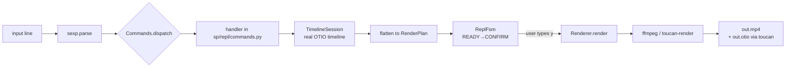
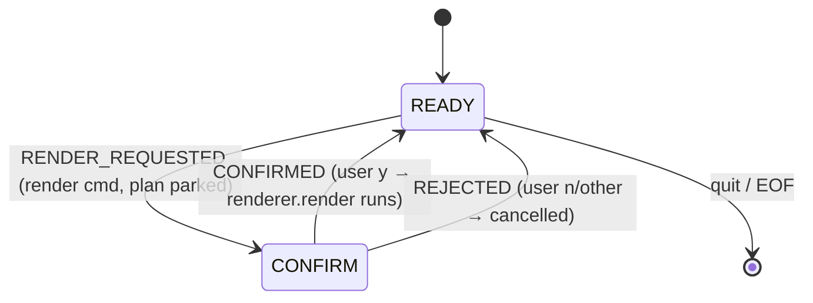

# SPEC — SP (package `sp`): minimum video editor REPL

Software Requirements Specification and architecture reference.
Audience: any agent or developer picking this project up later.
Status: implemented (v0.1.0), all 107 tests green.

---

## 1. Overview

`sp` is an absolute-minimum video editor that lives in a REPL. You type
s-expressions (sexpistol syntax) into an IRB-like prompt; each form mutates
a real OpenTimelineIO timeline; rendering is delegated to FFmpeg (or to
`toucan-render` when installed).

```
sp> (open "clip.mp4")
sp> (trim 1 3)
sp> (timeline)
sp> (render "out.mp4")     # shows the planned FFmpeg command, asks y/N
```

### Design stance: do not reinvent the wheel

| Concern | Wheel used | Why |
|---|---|---|
| S-expression syntax | **sexpistol port** (`sp/sexp/parser.py`) | User-specified grammar; faithful to https://github.com/aarongough/sexpistol |
| Timeline model | **OpenTimelineIO 0.18** (pip) | No Ruby binding exists; hand-rolling a timeline model would duplicate OTIO |
| Probe | **ffprobe** (JSON mode) | De-facto standard metadata reader |
| Render | **FFmpeg** filter-graph; **toucan-render** auto-detected | toucan is the OTIO-native renderer; its Windows superbuild is deferred (TODO D.1) |
| REPL UX | **vex**-inspired | plan-before-render confirmation, `doctor` command, error-resilient loop |

### Explicit non-goals (v0.1)

- undo/redo, saved projects, session persistence (beyond writing `.otio`)
- multi-track compositing, transitions, effects, speed ramps
- mixed audio/no-audio renders (rejected with a clear error)
- LLM/natural-language commands (that is vex; this is a structured REPL)

---

## 2. Architecture

### 2.1 Vertical slices

```
┌─────────────────────────────────────────────────────────────────┐
│  shared/   errors · logging_setup · services (locator) · process │  ← no slice deps
├─────────────────────────────────────────────────────────────────┤
│  sexp/     parser (sexpistol port): parse() / to_sexp()          │  ← depends: shared
├─────────────────────────────────────────────────────────────────┤
│  media/    probe (ffprobe) · render (ffmpeg/toucan) + RenderPlan  │  ← depends: shared
├─────────────────────────────────────────────────────────────────┤
│  timeline/ TimelineSession (wraps real OTIO)                     │  ← depends: shared, media
├─────────────────────────────────────────────────────────────────┤
│  repl/     state (FSM) · commands (table) · loop (REPL + CLI)     │  ← depends: all above
└─────────────────────────────────────────────────────────────────┘
```

Dependency rule: arrows point downward only; `shared` imports nothing from
slices; `repl` is the composition root (only place that wires concrete
implementations together, via the service locator).

### 2.2 Data flow of one command



### 2.3 Render confirmation state machine



While `CONFIRM`, input is routed as a y/N answer, *not* as a command.
Prompt: `sp> ` (READY, empty) → `... ` (READY, multiline buffer) →
`sp(y/N)> ` (CONFIRM).

---

## 3. Data model

### 3.1 OTIO mapping (what "wrapping OTIO concepts" means here)

| OTIO concept | Where it appears in sp |
|---|---|
| `Timeline` | `TimelineSession._timeline` (name `"sp"`, exposed as `.timeline`) |
| `Track` (kind Video) | single track `V1`; clips appended by `(open)` |
| `Clip` | created by `(open)`; name = basename of the file |
| `ExternalReference` | `target_url` = path as typed; `available_range` from ffprobe duration |
| `source_range` (`TimeRange`) | narrowed by `(trim)`; read by `flatten()` |
| `RationalTime` | internal only; all public times are **seconds** (float), converted at the clip's frame rate |
| adapters (`.otio`) | `write_otio()` / `to_otio_json()`; ToucanRenderer writes `<out>.otio` |

### 3.2 Plain data structures

```python
MediaInfo(path, duration, rate, width, height, has_video, has_audio, codec)
Segment(url, source_in, source_out, has_audio)  # seconds, [in, out)
RenderPlan(segments, width, height, rate, otio_json=None)
```

- `RenderPlan` is the **seam** between the timeline slice and media slice:
  timeline produces it, renderers consume it.
- Output geometry/rate come from the **first** clip; renderers normalize
  every input to it (`scale`+`pad`+`fps`), so mixed resolutions are safe.
- `RenderPlan.validate()` rejects: empty plans, inverted/negative ranges,
  mixed audio/no-audio, bad geometry/rate — always as `CommandError`.

### 3.3 Service interfaces (Protocol classes)

```python
class Probe(Protocol):     # sp/media/probe.py
    def probe(path) -> MediaInfo

class Renderer(Protocol):  # sp/media/render.py
    name: str
    def explain(plan, out) -> str      # shown before confirmation
    def render(plan, out) -> None

Runner = Callable[..., CompletedProcess[str]]   # sp/shared/process.run shape
```

Wiring happens in `sp/repl/loop.py::bootstrap()` through
`sp/shared/services.py::registry` (service locator: register factory by
name → lazy cached instance; tests re-register fakes and `reset()`).

Concrete implementations:
- `Probe`: `Ffprobe` (real), test fakes in `tests/fakes.py::FakeProbe`
- `Renderer`: `FfmpegRenderer`, `ToucanRenderer`, `default_renderer()` picks
  toucan iff `shutil.which("toucan-render")`, else ffmpeg; tests use `FakeRenderer`

---

## 4. Command language

### 4.1 Grammar (sexpistol port)

```
expr    := list | string | number | symbol
list    := '(' expr* ')'
string  := '"' ( escape | any )* '"'     escapes: \n \t \r \v \f \b \a \0 \\ \" \' \/ \xHH \uXXXX
number  := int ('123', '-5') | float ('1.0', '2.0e10', '3e6')
symbol  := any bare token ('trim', 'a+', 'symbol?')
```

- `parse(source)` returns **one** top-level expression; trailing junk is a
  `ParseError`. Input ending mid-list/mid-string raises `ParseError` with
  `.incomplete = True` — the REPL uses this to keep buffering lines.
- `Symbol` is a `str` subclass: handlers treat symbols and quoted strings
  uniformly, round-trips stay faithful.
- Opt-in `python_literals=True` maps `nil/false/true` → `None/False/True`
  (off by default, mirroring sexpistol).
- `to_sexp(structure, scheme_compatible=False)` is the inverse serializer.
- **Windows caveat:** backslash starts an escape inside strings — type
  forward slashes: `(open "tests/fixtures/a.mp4")`.

### 4.2 Command surface (complete)

| Form | Args | Effect |
|---|---|---|
| `(open "file")` | 1 string | ffprobe → append `Clip` to `V1` |
| `(trim start end)` | 2 numbers (seconds) | narrow the **last** clip's `source_range`; validated against available media |
| `(timeline)` | – | print structure (duration, per-clip in/out, geometry) |
| `(render "out.mp4")` | 1 string | `flatten()` → validate → print planned command → `CONFIRM`; `y` renders, anything else cancels |
| `(doctor)` | – | python/OTIO/ffmpeg/ffprobe/toucan availability + current state |
| `(help)` | – | usage list |
| `(quit)` | – | exit (also EOF/Ctrl-C) |

Arity is enforced by `Commands.dispatch` **before** handlers run; every
user-facing failure is an `SpError` subclass printed as `** message` while
the session stays alive.

CLI (non-interactive, for scripting/tests around the model):
`sp -c '(trim 0 10)'` (exit 1 on error), `-v` (mirror `sp.log` to console),
`--version`. Also `python -m sp`.

---

## 5. Error model & logging

```
SpError
├── ParseError   (pos, incomplete flag → drives multiline buffering)
├── CommandError (misuse/semantic: arity, trim bounds, empty timeline, …)
└── ProcessError (cmd, returncode, stderr — replayable from sp.log)
```

The REPL loop catches `SpError` only; programming bugs (any other
exception) propagate — they are bugs, not user errors.

Logging (`sp/shared/logging_setup.py`): `sp.log` in the working directory
gets **everything** (DEBUG): each input line, each dispatched command with
args, every external process argv/exit/stderr, every FSM transition,
flatten/render results. Console shows WARNING+ only (`-v` mirrors all).
All external processes go through `sp/shared/process.py::run` — the single
choke point — so any failure can be replayed by hand from the log.

---

## 6. Testing strategy & debugging playbook

| Layer | How | Where |
|---|---|---|
| sexp parser | sexpistol README examples ported verbatim + round-trips + error flags | `test_sexp_parser.py` |
| probe | captured real ffprobe JSON fixtures (committed) → pure `_media_info_from_json`; `RecordingRunner` for wiring | `test_probe.py` |
| render | `build_command` asserted as pure data; runner injected; toucan writes `.otio` to tmp | `test_render.py` |
| timeline | `FakeProbe` + OTIO round-trip through the real adapter | `test_session.py` |
| FSM / commands / REPL | fakes + `ScriptedInput` (records prompts, EOF at end) | `test_state.py`, `test_commands.py`, `test_repl.py` |
| shared | locator semantics; real `run()` against `sys.executable` | `test_services.py` |
| end-to-end | generates clips via lavfi (`testsrc`/`sine`), open→trim→render→ffprobe validates; skipped if ffmpeg absent | `test_integration.py` |

**Debugging plan (use when something breaks):**
1. Failing unit test with fakes → the bug is in our logic (plan math,
   dispatch, FSM); no processes involved.
2. Failing integration test → read the logged command in `sp.log`, copy it,
   run it manually with `-loglevel warning` to see FFmpeg's real complaint.
3. REPL misbehaves interactively → `sp.log` shows the exact input line,
   parsed dispatch and handler; reproduce with `sp -c '(form)'`.
4. Re-run gate: `ruff format . && ruff check . && pytest`.

---

## 7. File map

```
sp/
├── sp/
│   ├── shared/ errors.py · logging_setup.py · services.py · process.py
│   ├── sexp/   parser.py                    (sexpistol port)
│   ├── media/  probe.py · render.py         (ffprobe, ffmpeg/toucan, RenderPlan)
│   ├── timeline/ session.py                 (OTIO wrapper: open/trim/flatten/write)
│   └── repl/   state.py · commands.py · loop.py (+ __main__.py entry)
├── tests/      fakes.py · test_*.py · fixtures/*.ffprobe.json (captured)
├── pyproject.toml        package `sp`, console script, pytest/ruff config
├── TODO.md               task board (incl. deferred items)
├── SPEC.md               this document
└── README.md             quick start
```

---

## 8. Requirements & environment

- Python **3.13** (OTIO 0.18.1 publishes wheels ≤ cp313; 3.14 unsupported)
- `opentimelineio>=0.18`, dev: `pytest`, `ruff`
- `ffmpeg` + `ffprobe` on PATH (render/probe); `toucan-render` optional
- Windows/Linux/macOS — no platform-specific code (paths via `pathlib`)

## 9. Known limitations

1. Single video track, clip order = append order (no move/reorder/delete).
2. `(trim)` acts on the **last** clip only.
3. Mixed audio/no-audio plans are rejected (future: auto-silence pads).
4. Times are seconds only (no frame-accurate `123f` notation yet).
5. No history/completion (readline binding omitted for minimalism).
6. A failed render drops back to READY; the pending plan is discarded
   (re-issue `(render ...)`).

## 10. Extension points (deferred roadmap)

- **D.1 toucan build** (Windows): VS2022 x64 Native Tools prompt →
  `git clone …/toucan && toucan\sbuild-win.bat` → `toucan-render` on PATH →
  `default_renderer()` switches automatically; renders then also emit
  `<out>.otio`. No code change required.
- **D.2 undo/redo**: snapshot `timeline.to_json_string()` before each
  dispatch in the REPL layer (session stays pure).
- **D.3 multi-track**: `TimelineSession` already exposes raw OTIO — add
  track management commands and extend `flatten()` (OTIO ranges are
  per-track; renderer support needed).
- **D.4 frame notation**: extend `_number()` in `commands.py` with `123f`.
